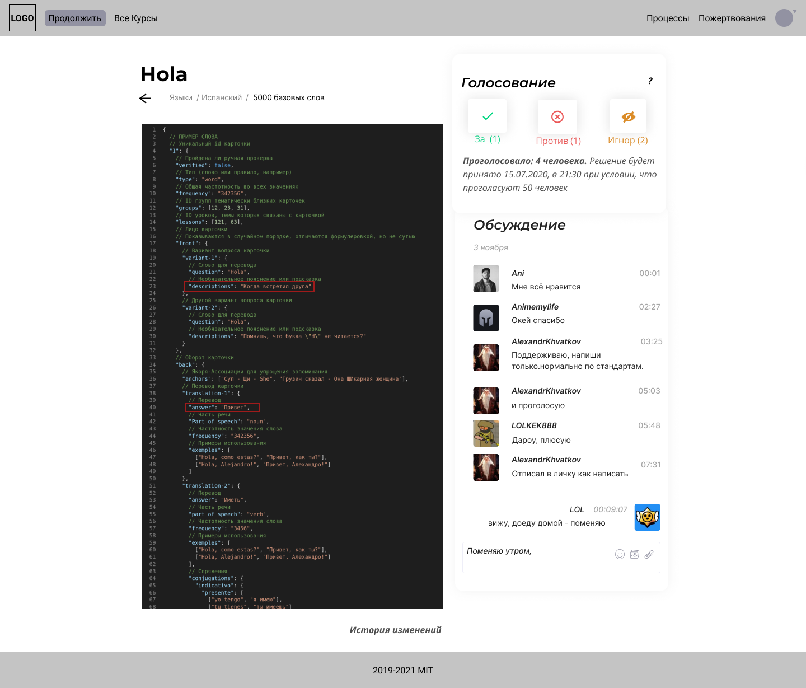

 

<h1>EDem</h1>

?>  [**Код**](https://github.com/grandcore/edem)
 [**Экраны**](https://www.figma.com/file/NlikNEJQHliYlxI3MHhiSW/Share?node-id=9473%3A1)
 [**Чат**](https://t.me/joinchat/TGPjZpSOcRfyhk7y)

Система коллективного управления проектами с возможностью гибко настроить алгоритмы принятия решений и кастомизировать интерфейсы работы над задачами.

- [Идеи для проекта](ru/2.1-edem/edem-ideas.md)
- [Схемы и карты](ru/2.1-edem/edem-map.drawio ":ignore")
- [0.1 (описание версии)](ru/2.1-edem/edem-v0.1.md)
- [1.0 (описание версии)](ru/2.1-edem/edem-v1.0.md)

**Кураторы проекта**

- [t.me/grandcore](https://t.me/grandcore)

## Цель проекта

Создать инструмент, который сможет стать ядром it-инфраструктуры для проектов, где необходимо совместно работать над задачами и коллективно принимать решения. Реализовать модульную архитектуру для кастомизации под задачи разных сообществ.

## Краткое описание

Любую систему использующую EDem можно условно разделить на две части. Первая - пользовательская, где размещён контент и реализованы необходимые сервисы. Вторая - процессы, где пользователи с необходимыми правами работают над контентом, конфигурацией сервисов, а также принимают другие решения. В пользовательской части могут размещаться триггеры для запуска связанных процессов, а так же ссылки на существующие процессы связанные с сущностями на странице.

Замечательная часть системы - интерфейс работы над процессами. Он имеет кастомизированную под разные задачи рабочую область, где пользователи имеющие необходимые права могут формировать предлагаемые изменения, например, добавлять/изменять/удалять блоки контента, номенклатуру разделов, менять права пользователям и их группам итд. Для каждого типа процесса можно гибко настроить условия принятия, например, 50% рядовых пользователей и хотя бы один модератор. В блоке обсуждения пользователи могу высказать своё мнение относительно повестки. Также можно настроить сброс голосования после изменений в рабочей области или добавлении нового комментария. После голосования пользователь перебрасывается на следующий по ролевантности процесс, в котором он имеет право принять участие.

Процессы автоматизируются с помощью специальных конфигурационных файлов, где описываются триггеры запуска, используемый движок рабочей области, группы пользователей, которым доступно участие в процессах, условия принятия решений и действия, которые будут совершаться в случае принятия решения. Движок EDem будет использоваться в практически во всех наших онлайн-сервисах.
