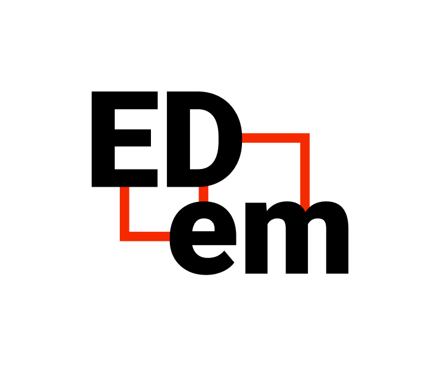

 

<h1>EDem</h1>

?>  [**Репозиторий**](https://github.com/grandcore/edem)
 [**Экраны**](https://www.figma.com/file/NlikNEJQHliYlxI3MHhiSW/Share?node-id=9473%3A1)
 [**Рабочий чат**](https://t.me/joinchat/TGPjZpSOcRfyhk7y)

Система коллективного управления проектами с возможностью гибко настроить алгоритмы принятия решений и кастомизировать интерфейсы работы над задачами.

- [Идеи для проекта](ru/2.1-edem/edem-ideas.md)
- [Схемы и карты](ru/2.1-edem/edem-map.drawio ":ignore")
- [0.1 (описание версии)](ru/2.1-edem/edem-v0.1.md)
- [1.0 (описание версии)](ru/2.1-edem/edem-v1.0.md)

**Кураторы проекта**

- [t.me/grandcore](https://t.me/grandcore)

## Цель проекта

## Краткое описание
