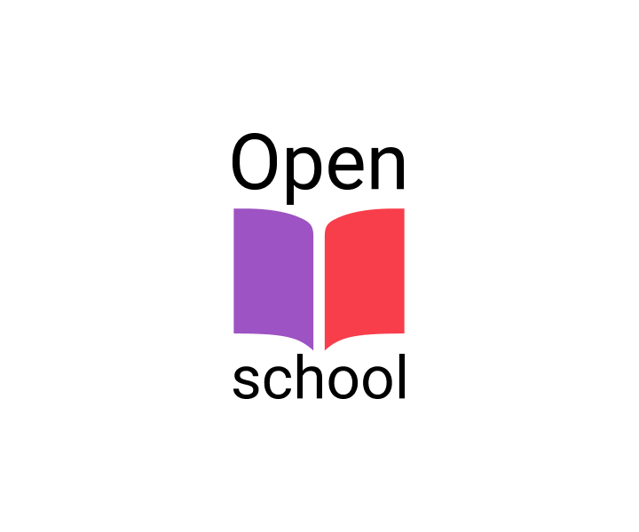

# OpenSchool

?>  [**Репозиторий**](https://github.com/grandcore/openschool")
 [**Экраны**](https://www.figma.com/file/NlikNEJQHliYlxI3MHhiSW/Share?node-id=9473%3A4)
 [**Рабочий чат**](https://t.me/joinchat/WOqWW6843XYND-Zb)

Открытая образовательная платформа. Курсы созданные силами сообщества с сервисом проверки заданий и колодами карточек Anki.
