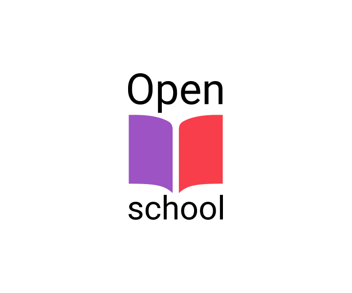
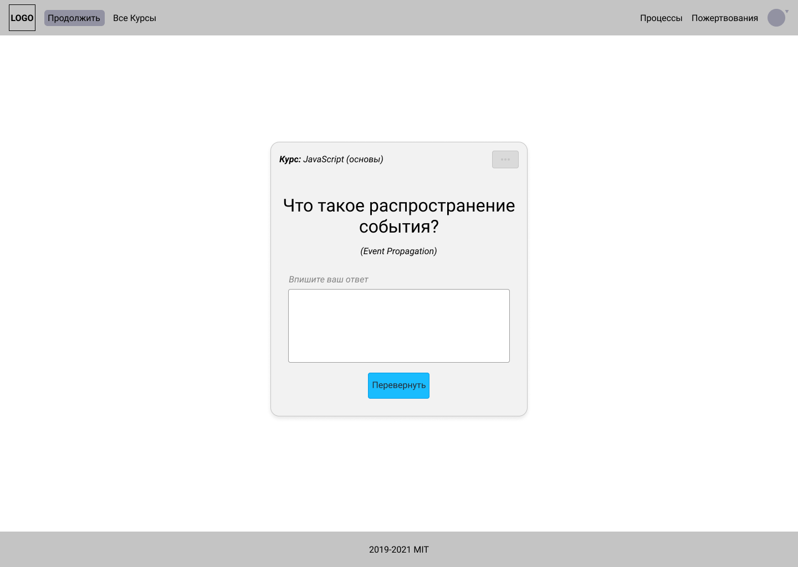

 

<h1>OpenSchool</h1>

?>  [**Код**](https://github.com/grandcore/openschool")
 [**Экраны**](https://www.figma.com/file/NlikNEJQHliYlxI3MHhiSW/Share?node-id=9473%3A4)
 [**Чат**](https://t.me/joinchat/WOqWW6843XYND-Zb)

Открытая образовательная платформа. Реализация подхода Anki (Duolingo), расширенного заданиями и внешними ссылками на материалы. Формирование курсов выполняется сообществом и профессиональными преподавателями, труд которых оплачивается с помощью краутфандинга.

- [Идеи для проекта](ru/2.3-openschool/openschool-ideas.md)
- [Схемы и карты](ru/2.3-openschool/openschool-map.drawio ":ignore")
- [0.1 (описание версии)](ru/2.3-openschool/openschool-v0.1.md)
- [1.0 (описание версии)](ru/2.3-openschool/openschool-v1.0.md)

**Кураторы проекта**

- [t.me/grandcore](https://t.me/grandcore)

## Цель проекта

Создание свободной образовательной платформы, которая позволит эффективно и бесплатно учиться детям и взрослым во всём Мире.

## Краткое описание

Платформа представляет из себя каталог созданных сообществом с помощью процессов [EDem](ru/2.1-edem/edem.md) курсов на разные темы в виде карточек с вопросами на конкретные темы, качество ответов на которые пользователи должны честно оценить самостоятельно. В зависимости от того, как оценит свой ответ на вопрос пользователь он будет повторяться либо в ближайшее время, либо в следующие дни. Причём, с каждым правильным ответом повтор будет происходить через ещё больший промежуток времени, пока карточка полностью не исчезнет из колоды.

Каждая карточка, кроме подробного ответа на обратной стороне имеет задания и ссылки на обучающие материалы по теме. Каждый день в колоду добавляются новые карточки и карточки для повторения, для которых пришло время. Кроме того, после завершения карточек пользователь может обработать остальные карточки колоды, выбирая те, которые ему интереснее всего и он хочет добавить в основную колоду.
