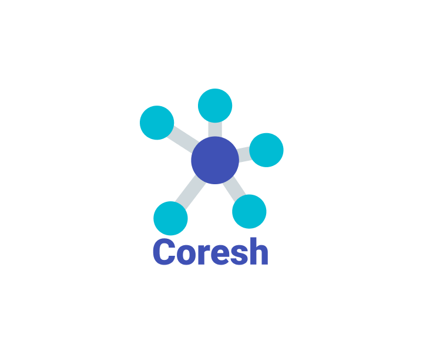

# Coresh

?>  [**Репозиторий**](https://github.com/grandcore/coresh")
 [**Экраны**](https://www.figma.com/file/NlikNEJQHliYlxI3MHhiSW/Share?node-id=9566%3A8798)
 [**Рабочий чат**](https://t.me/joinchat/EyxWDelw7VKZPTuO)

Сервис для поиска друзей на базе телеграм-бота. Помогает найти единомышленников задавая вопросы сообществу, а так же отвечая на вопросы и оценивая ответы других пользователей.

**Кураторы проекта**

- [t.me/grandcore](https://t.me/grandcore)
- [t.me/Mechislav](https://t.me/Mechislav)

## Черновик v 1.0

_Черновик для v0.1, над которой мы сейчас работаем можно посмотреть [здесь](https://github.com/grandcore/coresh/blob/main/README-files/v0.1.md)_

Пользователь получает с паузой в сутки набор карточек для взаимодействия с сообществом, который называется спринтом. С помощью карточек задаются вопросы сообществу, даются ответы на вопросы других юзеров и оцениваются их мысли, что формирует связи для алгоритмов рекомендаций. После прохождения спринта пользователь может посмотреть историю активности лучшего по мнению алгоритма потенциального друга, а так же пользователей для которых он сам стал лучшей парой, если такие есть. При взаимной симпатии - система позволяет обменяться контактами.

<!-- asas -->

Платформа выбирает интересных для пользователя людей с помощью рейтинга соседства. В алгоритме рекомендаций учитывается совместимость по типажу, который определяется на основе опросника пройденного пользоватем после регистрации, лайков мыслей других юзеров, общим подпискам на теги и прочим весам (см. описание алгоритмов ниже). Сервис не учитывает пол, возраст и другие анкетные данные не связанные с качествами личности. Платформа имеет открытый исходный код, средства на содержание и разработку собираются с помощью пожертвований, данные пользователей никак не используются в коммерческих целях.

Цель алгоритмов сервиса - быстро поместить пользователя в среду с потенциально самыми близкими по духу людьми, дать шанс быстро стать популярными в своей среде, быстро убирать из общего вывода пользователей, которые не нравятся основной массе сообщества, формируя отдельный мир аутсайдеров внутри платформы.

---

## Вводная информация

---

### Основные термины

**Пользователь:** человек зарегистрированный в системе. Может так же называться участником и юзером.

**Сообщество:** все прользователи платформы

**Собеседник:** высшая категория для друга и соседа.

**Соседи:** потенциальные собеседники, которые автоматически добавляются в список соседей в случае совпадения типажа или лайка их карточки. Соседи имеют рейтинг соседства. Пользователи с самым высоким рейтингом соседства после каждого спринта взаимно предлагаются друг-другу стать друзьями. Пользователь может заблокировать.

**Друзья:** собеседники, которые были предложены системой как потенциальные друзья и были взаимно одобрены обеими сторонами. Друзья могут смотреть ленты активности друг-друга, так же им доступны ссылки на их личные аккаунты в Телеграме.

**Языки:** доступные в сообществе языки. Пользователи могут выбирать языки которыми они владеют. Система автоматически определяет язык карточек и показывает их тем юзерам, которые владеют этими языками.

**Карточка:** интерфейс позволяющий написать вопрос и дать ответ на вопросы сообщества, оценить ответы других пользователей, а так же, например, пройти опросник на определение знания языков, типажа и интересов пользователя и т.д. Является частью спринта. В таблице юзера текущая карточка хранится в трёх ячейках, которые формируют число типа "1.2.5", где первый блок цифр - группа карточек, второй - номер самой карточки в группе, третий - счётчик показа одной и той же карточки, там где это нужно. Каждая карточка основана на базовом классе, например, "вопрос" и дополнена параметрами для формирования карточки для конкретного шага.

**Спринт:** генерируемый алгоритмами рекомендаций персональный набор карточек для пользователя. В конце каждого спринта пользователю предлагаются новые друзья - собеседник имеющий самый высокий рейтинг соседства и юзеры, если они имеются, для которых пользователь сам является соседом с самым высоким рейтингом соседства. Далее, перед началом нового спринта пользователь должен подождать 24 часа. Позиция спринта представляется в формате "этап.шаг.повтор_шага", например "2.3.4".

**Этап (Спринта):** спринт группируется на этапы, данная сущность создана для удобства и не несёт в себе дополнительного смысла.

**Шаг (Этапа Спринта):** сформированная карточка на основе базового класса (вопрос, ответ итд) с определёнными переданными параметрами.

**Типаж:** Типажи созданы как один из коэффициентов для алгоритмов рекомендаций. Они не связаны с какими-то интересами или убеждениями пользователей, но помогают находить более комфортных по общему бэкграунду людей, что особенно полезно для новых пользователей. В базе представляются в виде кодов. "0" - код для "не важно". Для остальных - "1", "2" итд. Т.е., чтобы попасть в соседи по типажу нужно совпонедение "1/1" или "1(2,3...)/0", но никак не "1/2". Текущий список вопросов для определения типажей см. [здесь](README-files/semantic-list.md).

**Теги:** интересы, жизненные взгляды, темы для обсуждения и прочее. Пользователь должен указать своё отношение к каждому тегу в процессе прохождения спринта. Ответы на теги являются важным критерием в формировании спринта. Отношение к тегу имеют три градации: "не интересно" - вопросы по тегу не отображаются, "интересуюсь" - низкий приоритет показа карточек, "занимаюсь/поддерживаю/итд" - высокий приоритет показа карточек и повышенный рейтинг соседства для собеседников, которые указали этот же тег. Текущий набор тегов вы можете увидеть [здесь](README-files/semantic-list.md).

---

### Веса для алгоритмов

_Переменные от значений которых зависит работа алгоритмов_

- **Рейтинг Пользователя** : у каждого юзера есть личный рейтинг. Он существует параллельно с рейтингом вопросов и ответов. Например, пользователь лайкнул чей-то ответ и рейтинг добавится не только карточке, но и собеседнику. Если рейтинг станет отрицательным, пользователь сможет общаться только с другими юзерами, которые так же имеют отрицательный рейтинг. Пользователям с положительным рейтингом так же не доступны карточки собеседников с отрицательным рейтингом.
- **Глобальный рейтинг Тега** : рейтинг тега равен количеству вопросов по нему.
- **Глобальный рейтинг Вопроса** : увеличивается при ответе на него, а уменьшается, если пользователь указал, вопрос ему не нравится.
- **Глобальный рейтинг Ответа** : увеличивается - если пользователь лайкнул ответ, уменьшается - если нажал кнопку "далее", или заблокировал автора вопроса.
- **Личный рейтинг Соседства** : собеседники, которые были добавлены после прохождения теста на определения типажа, а так же юзеры карточки которых пользователь хоть раз лайкнул - добавляются в список соседей и в дальшейшем, лайкая или дислайкая их карточки, изменяется рейтинг соседства.

---

## Базовые экраны и классы

---

### Точка входа

После запуска бота - система проверяет существует ли пользователь. Если нет - в базу записываются его данные и время регистрации, после проверки он перекидывается на главный экран. Если пользователь забанен - выводится сообщение "Вам здесь не рады". Модифицируется время последнего запуска бота пользователем.

---

### Главный экран

Проверяется статус спринта. Проверяется шаг спринта, если шаг 0.0, проверяется время и если прошли 1 сутки, шаг меняется на 1.1 или передаётся оставшееся время до возможности начать новый сринт.

На экране расположены 3 кнопки.

- Кнопка "Запустить спринт" - вызывает базовый класс спринт-роутера. Если шаг 0.0 - отображается оставшееся время до возможности начать спринт.
- Кнопка "Настройки" - переход в "раздел настроек".
- Кнопка "Мои Друзья" - переход в "раздел Друзей".

---

### Раздел Друзей

Проверяется список друзей пользователя. Если друзей нет - выводится сообщение "Вы пока что не нашли друзей".

Если друзья есть - выводится список друзей в формате - Имя / кликабельный юзернейм / кнопка "Лента" / кнопка "Удалить".

При нажатии на кнопку "Лента" - выводятся последний ответ или ворос пользователя. Ниже - кнопки ">>" и "<<"

Нажав на кнопку "Удалить" - пользователю предлагается подтвердить своё желание. Пользователи взаимно больше не будут пересекаться на платформе и иметь доступ к профилям друг-друга.

---

### Раздел Настроек

На странице присутствует 2 кнопки. "Удалить Аккаунт", "Обнулить аккаунт".

"Обнулить аккаунт" - появляется экран с предложением "Подтвердить обнуление". После подтверждения - сбрсываются теги и ответы на опрос по типажу, а так же языки пользователя. Это позволит заново ответить на все вопросы в ходе спринтов.

"Удалить Аккаунт" - появляется экран с предложением "Подтвердить удаление". После подтверждения - в таблице юзера добавляетсявлаг true в поле delete.

---

## Экраны и алгоритмы карусели

---

Ниже описываются классы и их экземпляры связанные непосредственно со сринтом

### Спринт-Роутер

При запуске спринт обращается к этому классу. Проверяется текущий шаг пользователя и в зависимости от шага запускается класс нужной карточки с необходимыми параметрами. После завершения шага - в таблице юзера обновляется значение поля с текушим шагом и класс роутера запускает следующий шаг, либо, при необходимости повторяет текущий.

### Базовые классы Карточек

**Ожидание:** проверяется, прошли ли сутки с последнего завершенного спринта. Если нет - выводится сообщение "Вы сможете начать новый сринт через n часов n минут".

**Вилка спринта:** сопоставляется общее количество ответов пользователя по профилю (языки, типаж, теги) и текущее общее количество вопросов для заполнения профиля в системе. В зависимости от результата выбирается следующий шаг для спринта.

**Добавление языков:** возвращается язык, который пользователь ещё не указал. Возвращается карточка с двумя вариантами ответа - "знаю/не знаю". Проверяется - есть ли ещё необработанные языки, если да, запускается заново.

**Опрос на типаж:** возвращается вопрос на типаж, который пользователь ещё не указал. Возвращаются варианты ответа для конкретной карточки. Проверяется - есть ли ещё необработанные вопросы, если да, запускается заново. Когда вопросов не осталось, перед переходом на следующий шаг запускается скрипт поиска соседей по типажу.

**Подписка на теги:** возвращается тег, который пользователь ещё не выбрал. Возвращается карточка с тремя вариантами ответа - "интересно/не интересно/хорошо разбираюсь". Проверяется - значение в счётчике, если меньше указанного в экземпляре - запускается заново и добавляет +1 к счётчику.

**Вопрос от Пользователя для Участников Сообщества:** возвращаются группы тегов, после выбора группы тегов возвращаются теги группы. После выбора тега возвращается приглашение к вводу вопроса и кнопка выбора тега, которая возвращает пользователя к выбору групы тега.

<!-- TODO сделать группу тегов в базе -->

**Вопрос от Сообщества для Пользователя:** возвращается самый ролевантный для пользователя вопрос. Веса для алгоритма указываются в экземпляре класса в роутере. Выводится вопрос и 2 кнопки "ответить" и "плохой вопрос". Если нажать "ответить" - выводится приглашение к вводу. Собеседник получает + 1 к личному рейтингу, +1 к рейтингу вороса, +1 к рейтингу соседства у пользователя. Если нажать "Плохой вопрос" - те же значения -2. Когда пользователь нажимает "плохой вопрос" ему показывается 2 кноки - "следующий вопрос", "заблокировать собеседника". Если нажать "заблокировать собеседника" - рейтинг его вопроса и его личный рейтинг упадут на 5, и у пользователя и у собеседника в таблице соседства будет ban:true.

**Оценка Пользователем ответа Участника Сообщества:** возвращается самый ролевантный для пользователя ответ участника сообщества. Веса для алгоритма указываются в экземпляре класса в роутере.

**Инфрмационная Карточка:** возвращается случайная из списка информационная карточка на языке интерфейса пользователя. Кнопка "далее".

**Лучший для пользователя сосед:** возвращается юзер с самым высоким для пользователя рейтингом соседства. Возвращается карточка с его последним вопросом или ответом. Ниже карточки пагинация вида "<<" ">>". Ниже две кнопки - "предложить дружбу" и "заблокировать". Если выбрать "заблокировать" - выводится подтверждение.

**Юзеры для которых пользователь лучший сосед:** проверяется, есть ли юзер для которого пользователь является лучшим соседом. Если нет - меняется шаг и возвращается в роутер. Если есть - возвращается карточка с его последним вопросом или ответом. Ниже карточки пагинация вида "<<" ">>". Ниже две кнопки - "предложить дружбу" и "заблокировать". Если выбрать "заблокировать" - выводится подтверждение.

---

### Этап 0 (основные вопросы Пользователю)

**Шаг 0.0:** класс "Ожидание". Передаётся - время 24 часа. Роутер - 0.1

**Шаг 0.1:** класс "Вилка спринта". Передаётся - роутер (0.2 или 1.1)

**Шаг 0.2:** класс "Добавление языков". Роутер - 0.3

**Шаг 0.3:** класс "Опрос на типаж". Роутер - 0.4

**Шаг 0.4:** класс "Подписка на теги". Передаётся - количество повторов. Роутер - 1.1

---

### Этап 1 (класс - Вопрос от Пользователя для Участников Сообщества)

**Шаг 1.1:** роутер - 2.1

---

### Этап 2 (класс - Вопросы от Сообщества для Пользователя)

**Шаг 2.1:** запрос - теги на которые пользователь подписан >> вопрос юзера с самым высоким рейтингом соседства. Повтор - 3 раза. Роутер - 2.2

**Шаг 2.2:** запрос - теги на которые пользователь подписан >> самый новый вопрос. Роутер - 2.3

**Шаг 2.3:** запрос - теги на которые пользователь подписан >> самый популярный вопрос. Роутер - 2.4

**Шаг 2.4:** запрос - теги на которые пользователь подписан >> самый популярный вопрос соседа с самым маленьким рейтингом соседства >> самый новый сосед. Роутер - 3.1

---

### Этап 3 (класс - оценка Пользователем ответов Участников Сообщества)

**Шаг 3.1:** запрос - теги на которые пользователь подписан >> ответ юзера с самым высоким рейтингом соседства. Повтор - 20 раз. Роутер - 3.2

**Шаг 3.2:** запрос - теги на которые пользователь подписан >> самый новый вопрос. Роутер - 3.3

**Шаг 3.3:** запрос - теги на которые пользователь подписан >> самый популярный вопрос. Роутер - 4.1

---

### Этап 4 (класс - инфрмационная Карточка)

**Шаг 4.1:** запрос - основной язык пользователя >> случайная информационная карточка. Роутер - 5.1

---

### Этап 5 (предлагаемые Друзья)

**Шаг 5.1:** запрос - сосед с самым высоким рейтингом соседства >> самый старый сосед. Роутер - 5.2

**Шаг 5.2:** запрос - пользователь предложивший дружбу. Проверка - есть ли ещё, если да, запустить шаг заново. Роутер - 0.0

<!-- TODO понять как сохранять предложивших дружбу -->

---

## Классы-хелперы

---

### Формирование списка Соседей

## <!-- TODO выбрать алгоритм-->

### Определение языка

<!-- TODO выбрать библиотеку-->
