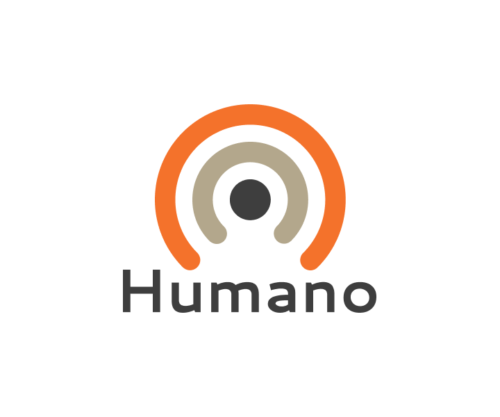

# Человеческий Язык

!> Данный проект является перспектиным. Если у вас есть желание участвовать, пишите в рабочий чат проекта.

?>  [**Репозиторий**](https://github.com/grandcore/lingohumano")
 [**Экраны**](https://www.figma.com/file/NlikNEJQHliYlxI3MHhiSW/Share?node-id=9473%3A3)
 [**Рабочий чат**](https://t.me/joinchat/FsYnmawRwjAsESKH)

Новая попытка создать международный (плановый) язык на основе текущих тенденциях Глоблиша и фонетического компромисса.
