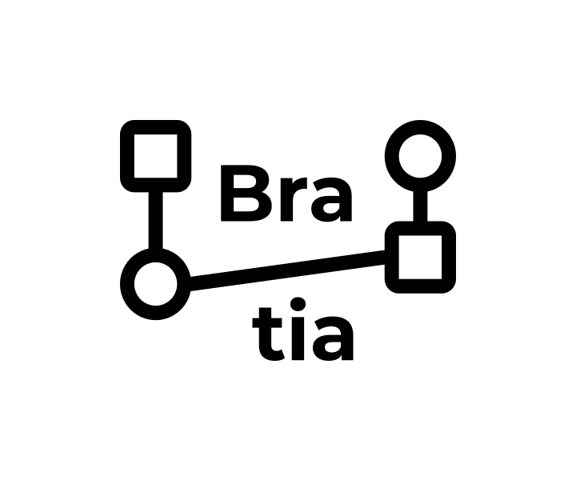

 

<h1>Bratia</h1>

!> Данный проект является перспективным. Если у вас есть желание участвовать, пишите в рабочий чат.

?>  [**Код**](https://github.com/grandcore/bratia)
 [**Экраны**](https://www.figma.com/file/NlikNEJQHliYlxI3MHhiSW/Share?node-id=8207%3A21160)
 [**Чат**](https://t.me/joinchat/FJcerjsmM23l8XHW)

Движок для виртуальных государств. Создания автономных социальных платформ свободных от внешней цензуры имеющих все необходимые социальные функции.

- [Идеи для проекта](ru/3.2-bratia/bratia-ideas.md)
- [Схемы и карты](ru/3.2-bratia/bratia-map.drawio ":ignore")
- [0.1 (описание версии)](ru/3.2-bratia/bratia-v0.1.md)
- [1.0 (описание версии)](ru/3.2-bratia/bratia-v1.0.md)

**Кураторы проекта**

- [t.me/grandcore](https://t.me/grandcore)

## Цель проекта

## Краткое описание
