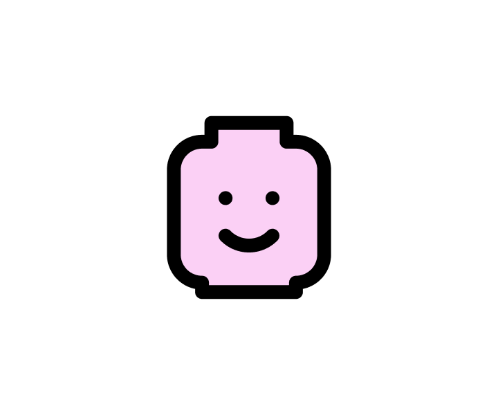

# Egitor

!> Данный проект является перспектиным. Если у вас есть желание участвовать, пишите в рабочий чат проекта.

?>  [**Репозиторий**](https://github.com/grandcore/egitor)
 [**Экраны**](https://www.figma.com/file/NlikNEJQHliYlxI3MHhiSW/Share?node-id=9473%3A2)
 [**Рабочий чат**](https://t.me/joinchat/GwwWCrrAtdbNROqG)

Творческий конвейер, выстраивающий процесс от потребления, обработки и накопления информации до реализации конечного творческого продукта.

- [Идеи для проекта](ru/3.3-egitor/egitor-ideas.md)
- [Схемы и карты](ru/3.3-egitor/egitor-map.drawio)
- [0.1 (описание версии)](ru/3.3-egitor/egitor-v0.1.md)
- [1.0 (описание версии)](ru/3.3-egitor/egitor-v1.0.md)

**Кураторы проекта**

- [t.me/grandcore](https://t.me/grandcore)

## Цель проекта

## Краткое описание
