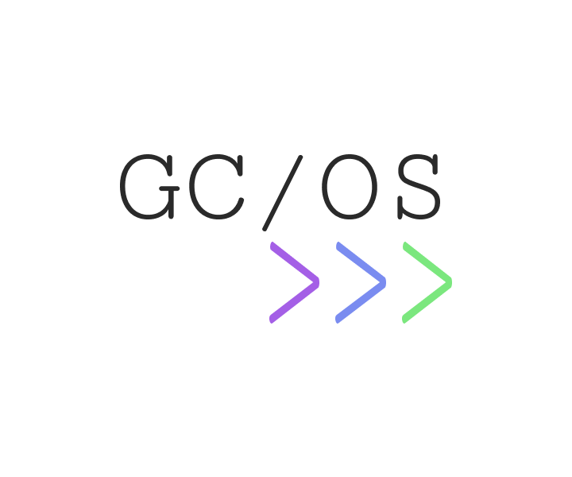

# GC/OS

?>  [**Репозиторий**](https://github.com/grandcore/gcos)
 [**Экраны**](https://www.figma.com/file/NlikNEJQHliYlxI3MHhiSW/Share?node-id=9473%3A0)
 [**Рабочий чат**](https://t.me/joinchat/F9bwPh_8usijiQDt)

Экспериментальный дистрибутив Linux основанный на Arch, заточенный на личную продуктивность и информационную безопасность.
