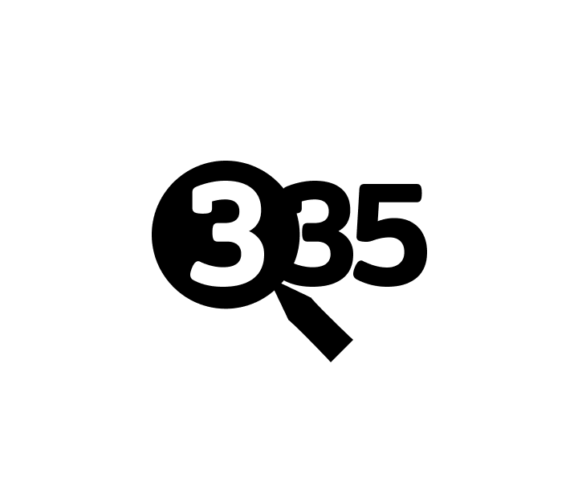

# project335

?>  [**Репозиторий**](https://github.com/grandcore/project335)
 [**Экраны**](https://www.figma.com/file/NlikNEJQHliYlxI3MHhiSW/Share?node-id=9473%3A5)
 [**Рабочий чат**](https://t.me/joinchat/FH6xqyRXvUpUC8PW)

Иной взгляд на интернет-поиск. Структурированная в ручном и полуавтоматическом режиме информация, вместо поисковой выдачи.
