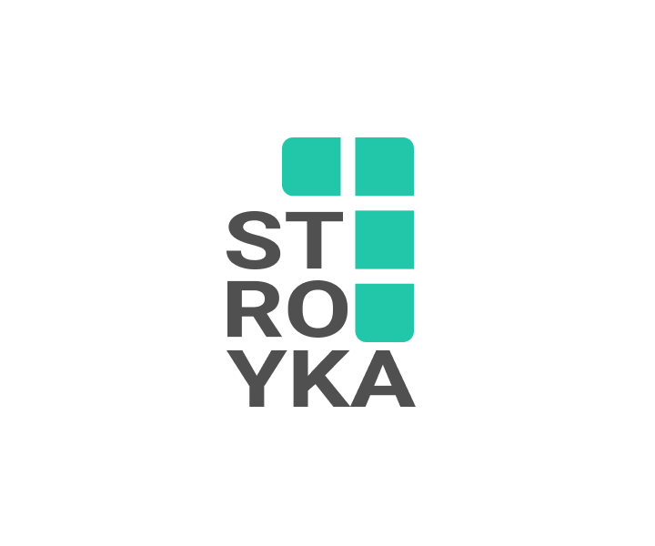

# Stroyka

?>  [**Репозиторий**](https://github.com/grandcore/stroyka)
 [**Экраны**](https://www.figma.com/file/NlikNEJQHliYlxI3MHhiSW/Share?node-id=9473%3A6)
 [**Рабочий чат**](https://t.me/joinchat/GPkcwp0wlxousk0T)

Фронтенд инфраструктура используемая проектами фонда GrandCore. UI-фреймворк, соглашения, скрипты автоматизации.
